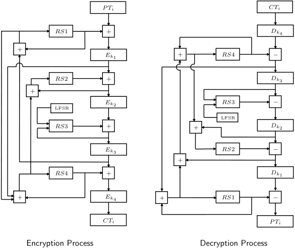

# Hummingbird

  В данной работе представлена HDL реализация алгоритма легковесного шифрования Hummingbird. Работа основана на работе Daniel Engels, Xinxin Fan, Guang Gong, Honggang Hu и Eric M. Smith «Ultra-Lightweight Cryptography for Low-Cost RFID Tags: Hummingbird Algorithm and Protocol». Ознакомиться с работой можно [здесь](http://www.silicon-russia.com/2017/06/09/arduino-and-fpga/).

  Проект реализован для платы De1-SoC и разработан в среде Quartus Prime Lite Edition 18.1. Больше информации по плате можно найти на сайте производителя [здесь](https://www.terasic.com.tw/cgi-bin/page/archive.pl?Language=English&CategoryNo=205&No=836&PartNo=4).

  В данной ветке представлен проект для Quartus. Для его запуска и тестирования скачайте проект. Файл проекта называется Hummingbird.qpf.

 

  Модель представленна в виде разных модулей, каждый из которых выполняет свою собственную функцию:
- **encryption_function** - модуль, выполняющий функцию шифрования, обрабатывает блоки данных по 16 бит и выполняет операции наложения ключа функцией xor, табличной замены S-box и линейного преобразования linear_transform;
- **decryption_function** - схожий модуль, выполняющий обратное преобразование строки (функция дешифрования);
- **linear_transform_enc** и **linear_transform_dec**- модули, выполняющие алгоритм линейного преобразования с использованием операций циклического сдвига и xor;
- **S_box** - множество модулей, представляющих из себя набор таблиц замены. Обрабатывают значения величиной по 4 бита;
- **encryption** - модуль, выполняющий полный цикл шифрования одного блока данных. Представляет собой последовательность четырех модулей encryption_function с наложением значений регистров внутреннего состояния RS при помощи операции сложения по модулю 16;
- **decryption** - схожий модуль, выполняющий полный цикл дешифрования одного блока данных. Представляет собой последовательность четырех модулей decryption_function с наложением значений регистров внутреннего состояния RS при помощи операции вычитания по модулю 16;
- **initial_process** - модуль необходимый для выполнения операции инициализации системы, в данном модуле происходит управление регистрами состояний, обработка сигналов начала и окончания процесса шифрования и дешифрования. Модуль представляет собой автомат Мили, каждое из состояний которого представляет собой определенный процесс обработки данных;
- **final_humming** - верхний файл проекта, связывающий все модули системы в единое целое. В данном модуле указаны связи между модулями и шины данных для взаимодействия с устройством из вне;
